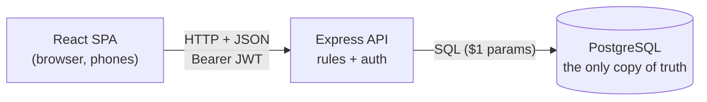
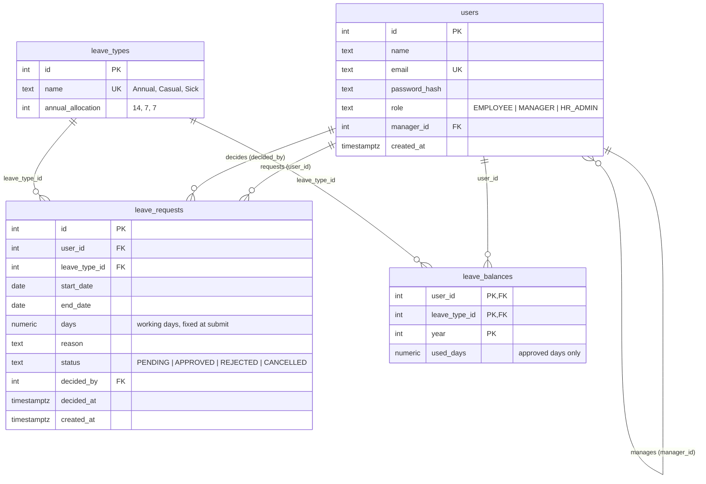
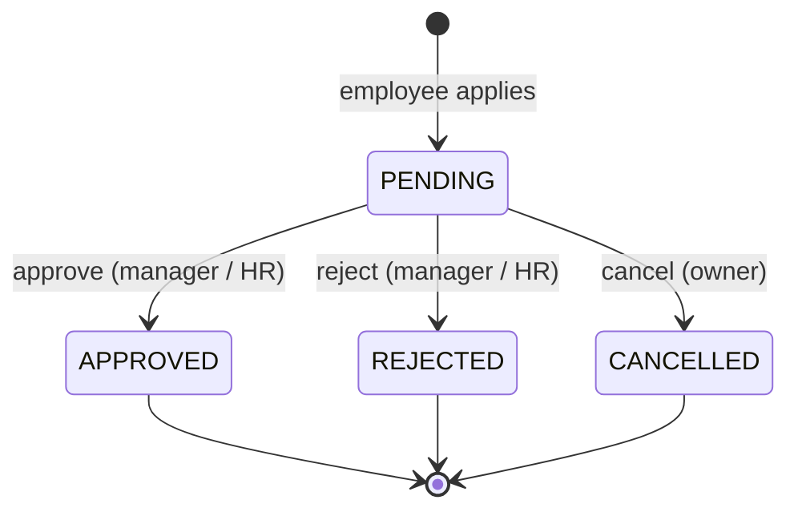
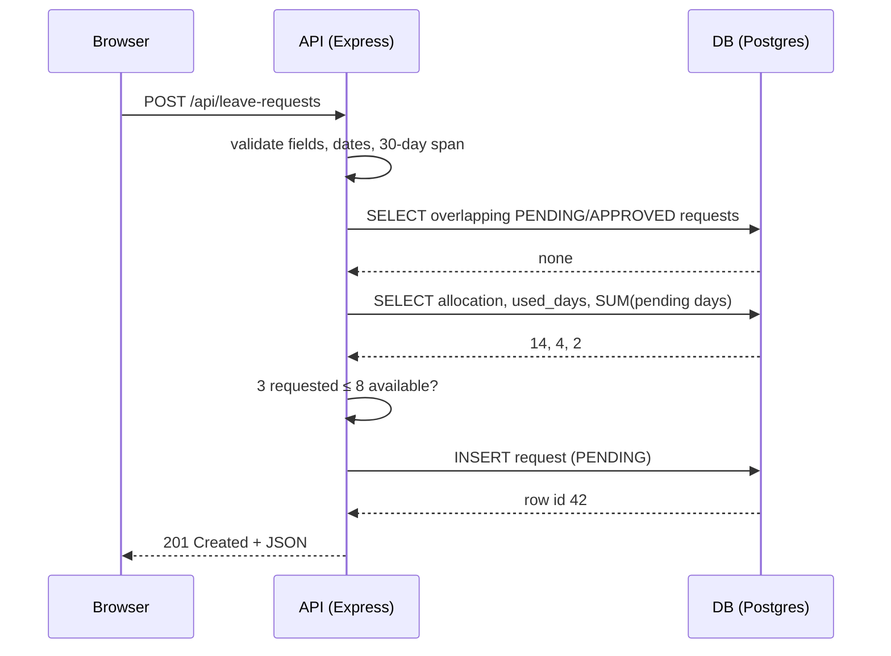

# DESIGN DOC — LeaveFlow v1

**Status:** draft, pending Nadeesha's answers to Q1–Q5 (see `requirements.md` §6)
**Date:** 2026-09 · **Related:** `docs/requirements.md` (SRS v0.1), `docs/api.md` (contract)

## Context

Ceylon Roots (~60 staff) tracks leave through email, WhatsApp and a spreadsheet. Requests get lost,
nobody knows their balance, and two of three QC officers were once off in the same week.
Must-haves for v1: login, apply, balances, approve/reject, cancel pending, request status
(US-1, 2, 3, 4, 5, 10). Employees use phones on the factory floor (NFR-4).

## Architecture

The browser never talks to the database. Every rule that matters — who may approve, balance limits,
state transitions — lives in the API, because anything in the browser can be bypassed with DevTools.

Build order: **v0** (Phase 3) is a single Express server with SQLite and no auth, to prove the path
end to end. **v1** (Phase 5) splits into the three tiers above.

## Data model

## Request state machine

No arrow leaves a final state, so "can I cancel an approved request?" has a definite answer: no → 409.

## Sequence — Ishara applies for leave

## Decisions

- **D1 — 3-tier: React SPA / Express API / PostgreSQL.** v0 is one Express server + SQLite so we can
  demo end to end in week 3; v1 splits the tiers.
- **D2 — Four tables:** `users`, `leave_types`, `leave_requests`, `leave_balances(user, type, year)`.
  Balances are per year because allocations reset annually and HR needs past years for audit.
- **D3 — Pending reserves days (from SRS).** `available = allocation − used_days − pending_days`.
  - `used_days` (approved) is stored in `leave_balances` and changes **only** inside the approve transaction.
  - `pending_days` is **computed** at read time: `SUM(days)` of the user's PENDING requests for that type/year.
  - `available` is never stored.
  Cancel and reject therefore need no balance update — the PENDING row simply stops counting.
- **D4 — Store `days` on each request**, computed once at submit. The day count depends on the
  weekend/holiday rules (Q3); fixing it at submit means a later holiday-calendar change can't silently
  rewrite the history of old requests. `NUMERIC(4,1)` leaves room for half days.
- **D5 — Status is an enum** checked by a `CHECK` constraint, driven by the state machine above.
- **D6 — Approve is one transaction:** `UPDATE leave_requests … WHERE id = $1 AND status = 'PENDING'`
  then upsert `leave_balances.used_days`. Both land or neither does.
- **D7 — JSON REST API under `/api`**, nouns in URLs, one error envelope `{ error: { code, message } }`.
- **D8 — Identity comes from the JWT**, never from the request body. Roles: EMPLOYEE, MANAGER, HR_ADMIN.
- **D9 — Approval flow assumption (pending Q1):** a request needs **one** decision, by the requester's
  manager *or* HR_ADMIN. HR can see and decide everything, which covers "it must come to me" in practice.
  If Nadeesha answers "manager then HR", we add a `MANAGER_APPROVED` state between PENDING and APPROVED —
  a state-machine change, cheap now, expensive after launch.

## Alternatives considered

- **A1 — Keep the spreadsheet plus scripts.** Rejected: no access control, no audit trail (NFR-2, NFR-3).
- **A2 — Store `remaining_days`.** Rejected: it is derived data and drifts after any bug or manual fix.
- **A3 — Store a `pending_days` counter too.** Rejected: every create/cancel/reject/approve would have to
  keep it in sync. Summing PENDING rows is exact and cheap at 60 users.
- **A4 — Compute `used_days` from APPROVED rows as well, drop `leave_balances`.** Viable and the
  "purest" option. Kept the table because it gives a home for future per-user allocations
  (rollover, Q2; pro-rata for new joiners), and a single writer (D6) keeps it honest.
- **A5 — `is_approved BOOLEAN`.** Rejected: can't tell REJECTED from CANCELLED from PENDING.
- **A6 — Half days as `day_part` enum (FULL/AM/PM) vs. only allowing `days = 0.5`.** Deferred to the
  capstone; D4's `NUMERIC(4,1)` already supports either.
- **A7 — Microservices / queues / cache.** Rejected for 60 users (NFR-5); see R1.

## Deferred requirements — designed for, not built in v1

| Requirement | Design sketch |
|---|---|
| Rule-1/2: sick > 3 consecutive days needs a medical certificate before approval | `certificate_url` column on `leave_requests`; approve returns `409 CERTIFICATE_REQUIRED` when `leave_type = Sick AND days > 3 AND certificate_url IS NULL` |
| Rule-3: no annual leave over New Year shutdown | `public_holidays(date PK, name, is_shutdown)` table; create returns `409 COMPANY_HOLIDAY` when an Annual request overlaps a shutdown date |
| US-11–13: finance year-end report | `GET /api/reports/leave-summary?year=&department=` (HR/finance role), CSV output; needs a `department` column on `users` |
| US-8: email on decision | sent after the approve/reject transaction commits, never inside it |

## Risks

- **R1** — 60 users is small; resist imaginary scale. Revisit only if Ceylon Roots' group companies join.
- **R2** — Q1 (approval flow) is unanswered; D9 is an assumption. **Blocking** for the approve endpoint's final shape.
- **R3** — Q3 (weekends/poya days) is unanswered; until answered, `days` = working days Mon–Fri, holidays not excluded.
- **R4** — Q2 (rollover) is unanswered; v1 resets allocations every 1 January.
- **R5** — Race: two requests submitted at the same moment could both pass the balance check.
  Acceptable at this scale; if it matters, lock the user's balance row (`SELECT … FOR UPDATE`) during create.
