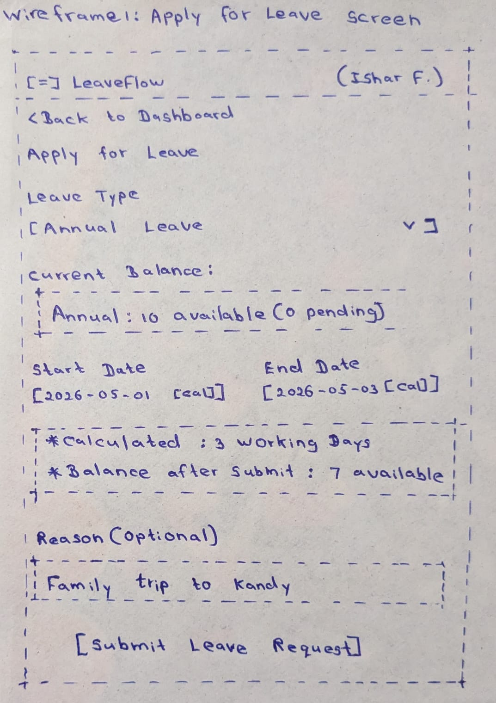
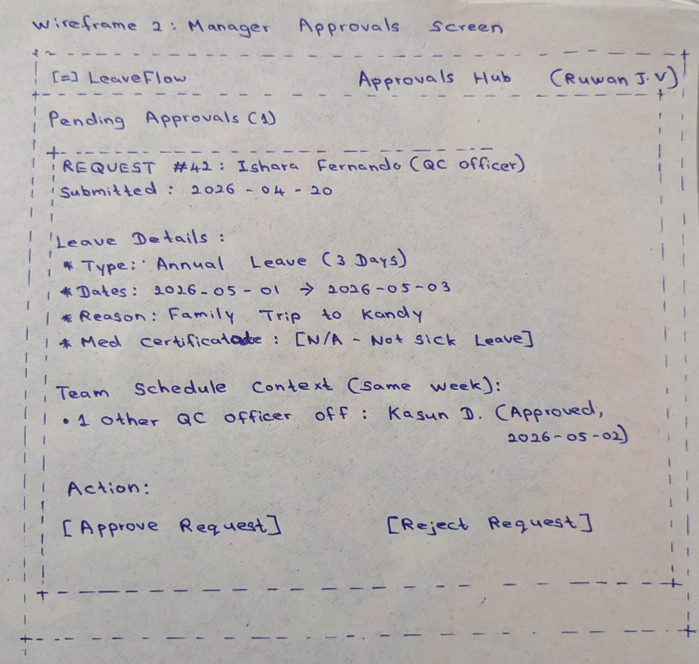

# LeaveFlow — SRS v0.1 (Draft, pending answers Q1–Q5)

**Customer:** Ceylon Roots (Pvt) Ltd — Nadeesha Perera, HR Manager
**Purpose:** Replace email/spreadsheet/WhatsApp leave tracking for ~60 staff.
**Scope (v1):** Authentication, request leave, approve/reject, cancel pending, view balances, notifications, HR oversight.
**Out of Scope (v1):** Payroll, WhatsApp integration, native iOS/Android mobile apps (responsive web instead).
**User Roles:** EMPLOYEE, MANAGER, HR_ADMIN.
**Leave Types & Annual Allocations:** Annual (14 days), Casual (7 days), Sick (7 days).
**Request State Machine:** `PENDING` -> `APPROVED` | `REJECTED` | `CANCELLED`.
**Balance Model:** Available balance = allocation − approved − pending. A pending request reserves its days the moment it's submitted, so two employees can't accidentally double-book the same undecided days. The UI always shows both numbers together, e.g. "8 available (2 pending)".

---

## 1. Stakeholders

1. **Employees (~60 staff):** Need to apply for leave, cancel pending requests, and check balance from a mobile phone.
2. **Managers / Team Leads:** Need to approve or reject their team members' requests quickly with a record.
3. **HR Admin (Nadeesha):** Needs company-wide visibility, oversight, and configuration of leave balances to stop corridor chaos.
4. **Finance Team:** Needs year-end leave usage reports without two days of manual paperwork.
5. **Company Directors:** Require accurate staffing coverage (e.g., QC team), policy compliance, and low software cost.

---

## 2. User Stories (Backlog)

* **US-1:** As an employee, I want to log in with my email and password, so that only I can act on my leave.
* **US-2:** As an employee, I want to apply for leave (type, dates, reason), so that requests stop living in WhatsApp.
* **US-3:** As an employee, I want to see my remaining balance per leave type, so that I stop asking Nadeesha ten times a day.
* **US-4:** As a manager, I want to approve or reject my team's pending requests, so that decisions are fast and recorded.
* **US-5:** As an employee, I want to cancel a request while it is still pending, so that changed plans don't need HR intervention.
* **US-6:** As an HR admin, I want to configure leave types and allocations, so that policy changes don't need a developer.
* **US-7:** As a manager, I want a calendar view of my team's approved leave, so that I never double-book the QC team again.
* **US-8:** As an employee, I want an email when my request is decided, so that I don't have to keep checking the app.
* **US-9:** As an HR admin, I want to see all requests across the company, so that I keep the oversight I have today.
* **US-10:** As an employee, I want to see the status of my requests (pending/approved/rejected/cancelled), so that I always know where I stand.

---

## 3. Acceptance Criteria (Given / When / Then)

### US-2: Apply for Leave
* **Scenario: Successful Submission**
  * **Given** I am logged in as an employee with 10 annual days available
  * **When** I submit an annual leave request for 3 working days with a reason
  * **Then** the request is saved with status `PENDING`
  * **And** my balance shows "7 available (3 pending)"
* **Scenario: Insufficient Balance**
  * **Given** my available annual balance is 2 days
  * **When** I request 5 annual days
  * **Then** the request is rejected with a clear "insufficient balance" error, and no days are reserved

### US-4: Approve or Reject
* **Scenario: Manager Approves Pending Request**
  * **Given** I am logged in as a manager and my direct report has a `PENDING` request for 3 annual days (reflected as "7 available (3 pending)" for that employee)
  * **When** I approve it
  * **Then** its status becomes `APPROVED`, with my user ID and timestamp recorded
  * **And** the employee's balance updates to "7 available" — the reservation simply converts to a confirmed deduction, the total doesn't change
  * **And** the employee is notified
* **Scenario: Action on Already Decided Request**
  * **Given** a request is already `APPROVED`
  * **When** anyone attempts to approve or reject it again
  * **Then** the action is refused with an error because decisions are final

### US-3: Balance Check
* **Scenario: Balance Calculation**
  * **Given** the year's default allocations are Annual 14, Casual 7, Sick 7
  * **And** I have 4 approved annual days taken and 2 annual days pending a decision
  * **When** I open my balances page
  * **Then** I see "Annual: 8 available (2 pending)", "Casual: 7 available", "Sick: 7 available"

---

## 4. MoSCoW Prioritization

* **Must Have (v1 Core):** US-1 (Login), US-2 (Apply), US-3 (Balances), US-4 (Approve/Reject), US-5 (Cancel Pending), US-10 (Request Status).
* **Should Have:** US-8 (Email notifications), US-9 (HR oversight view).
* **Could Have:** US-6 (Configurable leave types), US-7 (Team calendar view).
* **Won't Have (This Release):** Payroll processing, WhatsApp bot integration, native mobile app (responsive web design instead).

---

## 5. Non-Functional Requirements (NFRs)

* **NFR-1 (Auth & Security):** All actions require authentication; passwords must be hashed using bcrypt, never stored as plain text.
* **NFR-2 (Access Control):** System enforces strict Role-Based Access Control (`EMPLOYEE`, `MANAGER`, `HR_ADMIN`).
* **NFR-3 (Audit Trail):** Every approval or rejection must log who decided it and the exact timestamp.
* **NFR-4 (Mobile Responsiveness):** All employee-facing views must be responsive down to a 360px viewport.
* **NFR-5 (Scale):** Designed cleanly for ~60 active users and modest annual load without unnecessary microservice complexity.

---

## 6. Open Clarifying Questions for Nadeesha

1. **Approval Hierarchy Contradiction:** You mentioned team leads should approve their own people's leave, but also that every approval must come to you first. Should the workflow be: Manager only, HR only, or a two-step approval (Manager then HR)?
2. **Rollover Policy:** Do unused leave days carry forward to the following calendar year, or do they reset on December 31st?
3. **Holiday Exclusions:** Are weekends and public holidays (such as Poya days) excluded from the deducted leave day calculation?
4. **Retroactive Leave:** Can sick leave be requested retroactively after returning to work?
5. **Finance Report Format:** Could you provide a sample of the annual report finance requests so we can generate the exact schema?

---

## 7. Finance Reporting (Your Turn — Lab 1)

* **US-11:** As a finance officer, I want to export an annual leave summary per employee, so that I can close out reconciliation without two days of manual work.
  * **Given** approved leave records exist for the selected calendar year
  * **When** I generate the annual leave report
  * **Then** it lists each employee with days taken per leave type and remaining balance, downloadable as CSV

* **US-12:** As a finance officer, I want to filter the report by department and date range, so that I can reconcile one cost centre at a time.
  * **Given** the annual report exists
  * **When** I filter by department "QC" for Jan–Dec
  * **Then** only that department's records appear in the export

* **US-13:** As a finance officer, I want per-employee totals broken down by leave type (Annual/Casual/Sick), so that I can cross-check against payroll in one pass.
  * **Given** the report is generated
  * **When** I open it
  * **Then** each row shows separate Annual/Casual/Sick columns plus a total

---

## 8. Requirements Hidden in Nadeesha's Follow-up (Your Turn — Lab 2)

> "...when someone is sick more than three days running, we need the medical certificate on file before I approve — and the factory shuts for a week at Sinhala & Tamil New Year, so nobody should be able to book annual leave then, it's already company holiday."

* **Rule-1:** Sick leave requests longer than 3 consecutive days cannot be approved until a medical certificate is attached.
  * **Given** an employee submits 4 consecutive sick days with no certificate attached
  * **When** a manager attempts to approve it
  * **Then** approval is blocked with a message requiring the certificate first

* **Rule-2:** The 3-day threshold is a hard boundary, not an approximation — sick requests of 3 days or fewer never require a certificate.
  * **Given** an employee submits exactly 3 sick days
  * **When** they submit with no certificate
  * **Then** the request proceeds normally, no certificate required

* **Rule-3:** Annual leave cannot be booked over the Sinhala & Tamil New Year company holiday week, since it's already a paid holiday, not personal leave.
  * **Given** the New Year week is marked as a company holiday in the system
  * **When** an employee tries to request annual leave overlapping those dates
  * **Then** the request is rejected, explaining those days are already a company holiday

---

## 9. Wireframes (Your Turn — Lab 3, and Phase 1 checklist)

- [x] **Apply-for-leave screen**
  

- [x] **Manager's pending-approvals screen**
  

